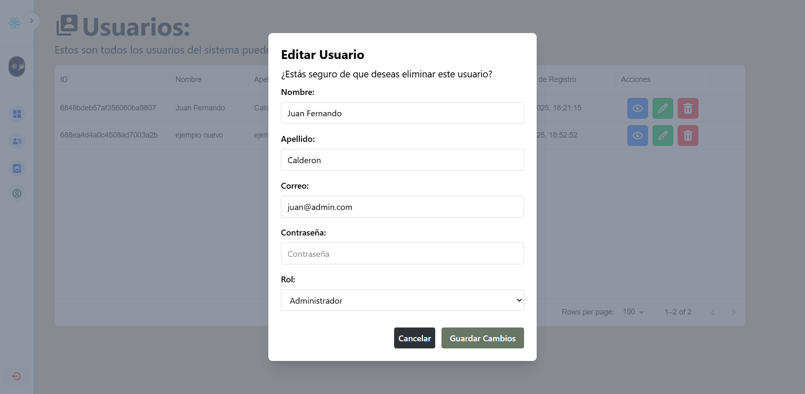
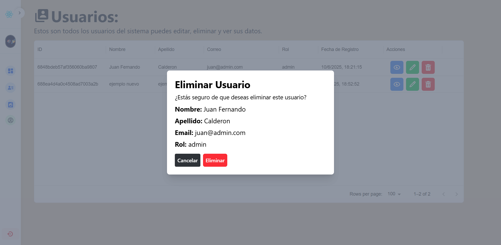

# Login Auth JWT NestJS + React

## Descripción
Este proyecto implementa un sistema de autenticación completo utilizando JWT (JSON Web Tokens) con un backend en NestJS y un frontend en React. El sistema incluye registro de usuarios, inicio de sesión, y manejo de sesiones con tokens JWT.

## Características Principales

### Backend (NestJS)
- **Autenticación JWT**: Implementación segura de JSON Web Tokens para manejo de sesiones
- **Validación de Datos**: Uso de class-validator para validación de entrada
- **Subida de Imágenes**: Soporte para subida de imágenes de perfil usando Multer
- **Base de Datos MongoDB**: Almacenamiento de datos usando Mongoose
- **Arquitectura Modular**: Estructura organizada siguiendo los principios de NestJS
- **Seguridad**: Encriptación de contraseñas y protección de rutas

### Frontend (React + Vite)
- **Interfaz Moderna**: Diseño responsive usando Tailwind CSS
- **Gestión de Estado**: Manejo eficiente del estado de la aplicación usando Zustand
- **Formularios Interactivos**: Validación en tiempo real y feedback visual
- **Vista Previa de Imágenes**: Funcionalidad para previsualizar imágenes antes de subirlas
- **Notificaciones**: Sistema de notificaciones usando Notyf
- **Rutas Protegidas**: Implementación de rutas privadas y públicas

## Tecnologías Utilizadas
- **Backend**:
  - NestJS
  - MongoDB con Mongoose
  - JWT
  - Multer para manejo de archivos
  - Class Validator

- **Frontend**:
  - React
  - Vite
  - Tailwind CSS
  - Axios
  - React Router DOM
  - Notyf
  - Zustand
  - React Query

## Estructura del Proyecto
```plaintext
├── backend/
│   ├── src/
│   │   ├── user/
│   │   ├── auth/
│   │   └── assets/
│   └── uploads/
└── frontend/
    ├── src/
    │   ├── Api/
    │   ├── assets/
    │   ├── components/
    │   ├── hooks/
    │   └── pages/
    └── public/
```

## Características de Seguridad
- Encriptación de contraseñas con bcrypt
- Validación de tokens JWT
- Protección contra ataques CSRF
- Validación de datos en frontend y backend
- Manejo seguro de sesiones con cookies HttpOnly
- Protección de rutas basada en roles (admin/user)

## Funcionalidades de Usuario
- Registro con imagen de perfil
- Inicio de sesión seguro
- Visualización y edición de perfil
- Cierre de sesión
- Panel de administración (solo admin)
- Gestión de usuarios (solo admin)

## Capturas de Pantalla

### Área Administrativa

#### Login del Sistema


#### Registro de Usuarios


#### Panel de Administración y Gestión de Usuarios





### Área de Usuario

#### Vista de Perfil Personalizada

#### Vista de Perfil Editar Personalizada


## Mejores Prácticas Implementadas
- Arquitectura limpia y modular
- Principios SOLID
- Manejo de errores consistente
- Validación de datos robusta
- Código tipado con TypeScript
- Documentación clara y mantenible
- Optimización de peticiones al servidor
- Gestión eficiente del estado global
- Responsive Design